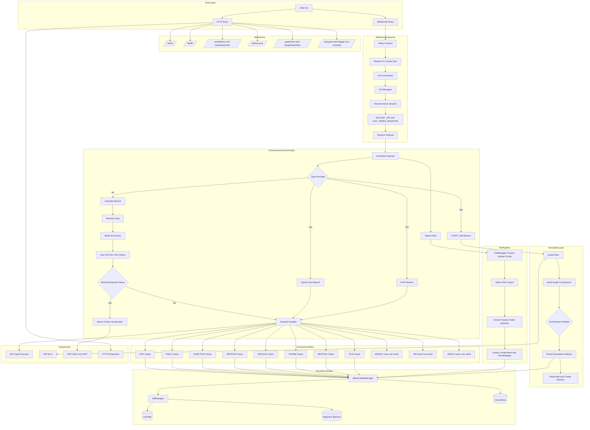

# BestBrain

BestBrain is a case-driven orchestration engine for simulation workflows across WebSocket + HTTP, manager buses, and QBRAIN-backed persistence.

## Expansive Workflow (Visible)



## Project Component Tree (Full Map)

```
BestBrain/
├── bm/                          # Django app (ASGI, settings, static)
│   ├── urls.py                  # Root URL routing → world/, auth/, graph/, health/, admin/
│   └── views.py                 # health(), spa_index (QDash catch-all)
├── qbrain/
│   ├── relay_station.py         # Relay (WebSocket consumer): connect, receive, send
│   ├── predefined_case.py      # RELAY_CASES_CONFIG (ENV, FIELD, INJECTION, SESSION, MODULE, PARAM, METHOD, FILE)
│   ├── urls.py                  # world/demo/, world/webhook/
│   ├── auth/urls.py             # auth/access/
│   ├── graph/
│   │   ├── local_graph_utils.py # GUtils (NetworkX graph, add_node, add_edge, schemas)
│   │   ├── brain.py             # Brain(GUtils): hydrate, ingest, classify_goal, execute_or_ask
│   │   ├── brain_schema.py      # Node/edge types, GoalDecision, DataCollectionResult
│   │   ├── brain_hydrator.py    # User-scoped DuckDB → LONG_TERM_STORAGE nodes
│   │   ├── brain_classifier.py  # Hybrid goal classification (rule / vector / fallback)
│   │   ├── brain_executor.py    # execute_or_request_more, debug metadata, payload guard
│   │   ├── brain_workers.py     # Thread pool for embedding/hydration offload
│   │   ├── models.py            # KnowledgeNode (CONTENT chunk schema)
│   │   ├── processor/           # FileProcessorFacade, BaseProcessor, graph_builder
│   │   ├── test.py              # Terminal Brain test (suite / interactive), Rich UI, JSON reports
│   │   └── dj/
│   │       ├── urls.py          # graph/view/, graph/brain/test/
│   │       ├── visual.py        # GraphLookup (POST graph JSON → streaming HTML)
│   │       └── brain_test.py    # HTTP Brain test chat (GET HTML, POST JSON chat/suite)
│   ├── core/
│   │   ├── orchestrator_manager/orchestrator.py  # OrchestratorManager: handle_relay_payload, START_SIM, typed dispatch
│   │   ├── guard.py             # Guard: main(env_id, env_data), build graph, pop_cmd(grid), persist model/anim
│   │   ├── qbrain_manager/      # QBrainTableManager: MANAGERS_INFO, run_query, set_item, _generate_embedding
│   │   ├── session_manager/     # SessionManager, session_manager (get_or_create_active_session)
│   │   ├── env_manager/         # EnvManager (env CRUD, retrieve_env_from_id)
│   │   ├── file_manager/        # FileManager: process_and_upload_file_config, RAG upsert, param/field/method extract
│   │   ├── param_manager/       # ParamsManager
│   │   ├── fields_manager/      # FieldsManager
│   │   ├── method_manager/      # MethodManager
│   │   ├── injection_manager/   # InjectionManager
│   │   ├── module_manager/      # ModuleWsManager, ModuleLoader, Modulator
│   │   ├── model_manager/       # ModelManager
│   │   ├── user_manager/        # UserManager (get_or_create_user, initialize_qbrain_workflow)
│   │   └── managers_context.py  # set_orchestrator, reset_orchestrator
│   ├── _db/
│   │   ├── manager.py           # DBManager (DuckDB / BigQuery), get_db_manager()
│   │   ├── vector_store.py      # VectorStore (create_store, upsert_vectors, similarity_search, classify)
│   │   └── workflows.py         # db_connect, db_exec, duck_insert
│   ├── chat_manger/             # AIChatClassifier (case classification from message)
│   ├── qf_utils/                # QFUtils, FieldUtils, runtime_utils_creator
│   ├── utils/                   # Utils, Manipulator, QueueHandler, serialize_complex, run_subprocess (pop_cmd)
│   └── code_manipulation/       # StructInspector (AST → graph), handler registration
├── jax_test/                    # External grid/simulation (optional)
│   └── grid/                    # Grid run, streamer, animation_recorder
├── docs/                        # PROMPT_*, GRID_STREAM_PROTOCOL, QDASH_GRID_CHECKLIST, etc.
└── startup.py                   # Migrations, collectstatic, QDash build, nginx, daphne
```

## Component Interactions (Who Calls Whom)

| From | To | Action |
|------|-----|--------|
| ASGI / Daphne | Relay | WebSocket at `/run/`; connect → receive → send |
| Relay | UserManager | get_or_create_user |
| Relay | SessionManager | get_or_create_active_session (via session_manager) |
| Relay | OrchestratorManager | Constructor(cases, user_id, relay=self) |
| Relay | Orchestrator | handle_relay_payload(payload) for every message |
| Orchestrator | AIChatClassifier | main(user_id, msg) when type missing or CHAT |
| Orchestrator | FileManager | process_and_upload_file_config when files in payload |
| Orchestrator | Guard | guard.main(env_id, env_data, ...) when data_type == START_SIM |
| Orchestrator | Relay | send(text_data=...) to push SET_SID, LIST_*, typed success/error |
| Guard | GUtils | add_node, add_edge (ENV, MODULE, FIELD, INJECTION, METHOD, PARAM) |
| Guard | QBrainTableManager | row_from_id, set_item, upsert_copy (params, fields, methods, envs) |
| Guard | pop_cmd (utils) | Run grid subprocess: `python -m jax_test.grid --cfg <cfg_path>` |
| Guard | GridStreamer (optional) | put_frame(step, data) when GRID_STREAM_ENABLED |
| FileManager | Param/Field/Method managers | Extract and upsert components; RAG upsert when corpus_id set |
| QBrainTableManager | DBManager | run_query, execute, insert (DuckDB or BigQuery) |
| Brain | GUtils | add_node (USER, GOAL, SUB_GOAL, SHORT_TERM_STORAGE, LONG_TERM_STORAGE, CONTENT), add_edge |
| Brain | BrainHydrator | hydrate_user_long_term(user_id) → LONG_TERM_STORAGE from MANAGERS_INFO tables |
| Brain | BrainClassifier | classify(query, long_term_nodes) → GoalDecision |
| Brain | BrainExecutor | execute_or_request_more(case_item, resolved_fields, missing_fields) |
| BrainClassifier | VectorStore | similarity_search for relay-case vectors; embed_fn from QBrain or deterministic fallback |
| graph/test.py | Brain | execute_or_ask(query, user_payload); save report to graph/test_runs/ |
| graph/dj/brain_test.py | Brain | POST JSON chat/suite → execute_or_ask; GET → HTML chat UI |

## Action Catalog (All Main Actions)

- **Relay**: `connect`, `receive`, `send`, `send_session`, `_send_all_user_sessions`, `_resolve_session`, `_save_session_locally`, `scan_dir_to_code_graph`
- **Orchestrator**: `handle_relay_payload`, `_ensure_data_type_from_classifier`, `_handle_start_sim_process`, `_dispatch_relay_handler`, `_resolve_case`, file detection and FileManager invocation
- **Guard**: `main(env_id, env_data)`, `create_nodes`, `data_handler`, `build_graph`, write config, `pop_cmd(grid)`, persist model/animation to env row
- **QBrainTableManager**: `run_query`, `run_db`, `execute`, `insert`, `set_item`, `row_from_id`, `upsert_copy`, `get_managers_info`, `_generate_embedding`, `initialize_all_tables`
- **DBManager**: `run_query`, `execute`, `close` (DuckDB or BigQuery)
- **VectorStore**: `create_store`, `add_vectors`, `upsert_vectors`, `delete`, `similarity_search`, `batch_similarity_search`, `classify`, `count`, `reset`, `optimize`, `close`
- **FileManager**: `process_and_upload_file_config`, `_step1_vertex_rag_upsert`, `_step2_extract_components_pipeline`, `_step3_upsert_components`, `_step4_upsert_files_table`, `_step5_upsert_module`
- **Brain**: `hydrate_user_context`, `ingest_input`, `classify_goal`, `collect_required_data`, `execute_or_ask`, `_cleanup_goal_and_subgoals`, `close`
- **BrainClassifier**: `classify(query, long_term_nodes)` → GoalDecision (rule / vector / fallback)
- **BrainExecutor**: `execute_or_request_more` (need_data | executed | error; execution_debug; payload serialization guard)
- **GUtils**: `add_node`, `add_edge`, `get_node`, `get_edge`, `local_batch_loader`, `save_graph`, `load_graph` (history/h_entry only when enable_data_store)
- **graph/processor**: `FileProcessorFacade.process_file`, `process_to_graph(path, g)`, `build_graph(rows, g)` → CONTENT nodes + parent_of / follows
- **HTTP**: `GET /health/`, `GET /world/demo/`, `GET /graph/view/`, `GET /graph/brain/test/`, `POST /graph/brain/test/` (chat/suite), SPA catch-all for QDash

## Workflow Mastermap

- Full visual workflow + exhaustive action catalog: `docs/PROJECT_WORKFLOW_MASTERMAP.md`

## Running all apps locally

The `_admin` CLI can run every discovered project (Dockerfile or package.json/manage.py/requirements.txt) **without Docker**: it infers start commands from project type and context (startup.py, manage.py, main.py, Dockerfile CMD, package.json scripts) and runs them natively.

- **Scan only** (print inferred command and cwd for each project):
  ```bash
  python -m _admin.main --run-local-scan-only
  ```
- **Run all** runnable projects (backend(s) and frontend(s) with default ports 8000, 3000):
  ```bash
  python -m _admin.main --run-local
  ```
- **Run one project** (path relative to repo root):
  ```bash
  python -m _admin.main --run-local --run-local-project qdash
  python -m _admin.main --run-local --run-local-project jax_test
  ```
- **Custom ports**: `--run-local-port 8000` or `--run-local-port backend_drf:8000,frontend:3000`

Projects are classified as `backend_drf`, `backend_fastapi`, `backend_py`, `frontend_react`, or `mobile_react_native`. The root Django app is run via `startup.py --backend-only` when present; the qbrain package and root backend are deduplicated (only one process). See `_admin/README.md` for the full inferred-command table and edge cases.

## Current Core TODOs (from existing intent)

- [ ] `get_data`: integrate BigQuery -> Sheets live data view (`table=ntype`, `col=px`, `row=ts state`).
- [ ] Improve method extraction (bracket parsing and dedupe) and reliably inject method defs into `Guard.method_layer`.

## Near-Term Engine Priorities

- [ ] Implement relay case consumption hardening and payload contract validation.
- [ ] Add Guard answer caching and cross-module parameter/field consistency checks.
- [ ] Add observability (latency, error rates, case-level tracing) for Relay/Orchestrator/Guard.