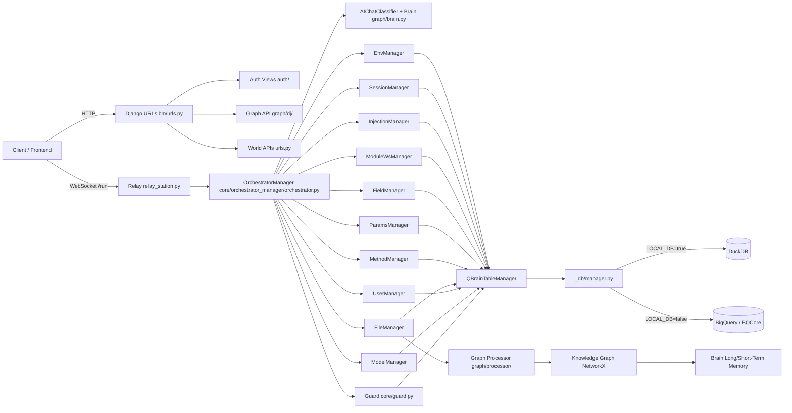
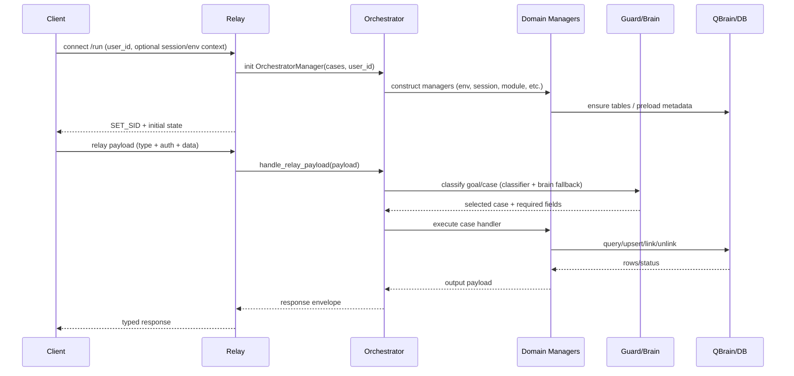
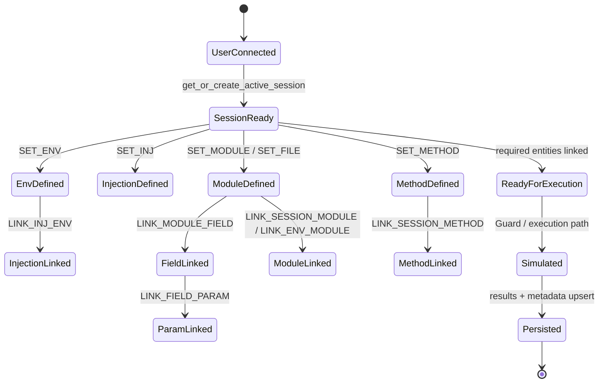

# BestBrain Project Workflow Mastermap

This document is an expansive visual + operational summary of how the full project behaves, what actions are possible, and what should be implemented next to form an optimized engine.

## Intent Inferred From Current TODOs

Current root TODO intent in `README.md` suggests:
- Build a reliable live data bridge (`get_data`) from BigQuery to Sheets/table views.
- Improve method extraction quality and route extracted method definitions into `Guard.method_layer`.

That intent expands naturally into a broader goal: **a stable, high-throughput simulation orchestration engine where Relay + Orchestrator + Guard + Graph + DB stay aligned and observable**.

## System Topology (Visual)

## Primary Runtime Workflow (Visual)

## Entity Lifecycle Workflow (Visual)

## Action Catalog: All Known Component Actions

### WebSocket Relay Case Actions (`predefined_case.py`)

- **Environment**
  - `SET_ENV`, `GET_ENV`, `GET_USERS_ENVS`, `DEL_ENV`, `DOWNLOAD_MODEL`, `RETRIEVE_LOGS_ENV`, `GET_ENV_DATA`
- **Session**
  - `LINK_ENV_SESSION`, `RM_LINK_ENV_SESSION`, `GET_SESSIONS_ENVS`, `LIST_USERS_SESSIONS`
- **Injection**
  - `SET_INJ`, `DEL_INJ`, `GET_INJ_USER`, `GET_INJ_LIST`, `LINK_INJ_ENV`, `RM_LINK_INJ_ENV`, `LIST_LINK_INJ_ENV`, `GET_INJECTION`
- **Module**
  - `SET_MODULE`, `DEL_MODULE`, `GET_MODULE`, `LIST_USERS_MODULES`, `GET_SESSIONS_MODULES`, `LINK_SESSION_MODULE`, `RM_LINK_SESSION_MODULE`, `LINK_ENV_MODULE`, `RM_LINK_ENV_MODULE`, `CONVERT_MODULE`
- **Field**
  - `SET_FIELD`, `DEL_FIELD`, `LIST_USERS_FIELDS`, `LIST_MODULES_FIELDS`, `GET_MODULES_FIELDS`, `LINK_MODULE_FIELD`, `RM_LINK_MODULE_FIELD`, `SESSIONS_FIELDS`
- **Param**
  - `SET_PARAM`, `DEL_PARAM`, `LIST_USERS_PARAMS`, `LINK_FIELD_PARAM`, `RM_LINK_FIELD_PARAM`, `GET_FIELDS_PARAMS`
- **Method**
  - `SET_METHOD`, `DEL_METHOD`, `GET_METHOD`, `LIST_USERS_METHODS`, `GET_USERS_METHODS`, `GET_SESSIONS_METHODS`, `LINK_SESSION_METHOD`, `RM_LINK_SESSION_METHOD`
- **File**
  - `SET_FILE`

### HTTP Actions

- **Core routes**
  - `/health/` (`bm/views.py`)
  - `/auth/*` (`auth/urls.py`)
  - `/world/*` (`urls.py`)
  - `/graph/view/`, `/graph/brain/test/` (`graph/dj/urls.py`)
- **Admin**
  - `/admin/`

### Graph/Brain Actions

- `Brain.classify_goal()`
- `Brain.fill_required_data()`
- `Brain.execute_case()`
- `Brain.hydrate_long_term_memory()`
- `Brain.add_short_term_memory()`
- Graph processor facade dispatch by file type (`graph/processor/main.py`)

### DB/Storage Actions

- Unified query execution in `_db/manager.py`
- Local/remote backend switch (DuckDB vs BigQuery)
- Vector store operations in `_db/vector_store.py`

## End-to-End Scenario Coverage

- **Scenario A: Manual modeling loop**
  - Create or fetch session -> set env -> create modules/fields/params/methods -> link all entities -> run/simulate -> persist and retrieve logs.
- **Scenario B: File-driven modeling**
  - Upload via `SET_FILE` -> extract methods/params/fields -> create module candidates -> link to session/env -> execute.
- **Scenario C: Injection-driven simulation**
  - Create injection waveform -> link injection to env -> map env into session -> run guard flow -> inspect outputs.
- **Scenario D: Retrieval and debugging**
  - Query env/session/module/method lists -> inspect graph via `/graph/view/` -> validate route alignment and case outputs.

## Optimized Engine TODOs (Implementation Backlog)

Backlog is merged from:
- Existing TODO markers across codebase.
- Current `README.md` TODO intent.
- Gaps required for production execution quality.

### P0 - Must Implement (Engine Integrity)

- [ ] **Case dispatch hardening**
  - Implement `Relay.consume_cases()` in `relay_station.py`.
  - Add strict validation for unknown `type` and malformed payloads.
- [ ] **Guard execution correctness**
  - Add answer caching and deterministic keying in `core/guard.py`.
  - Resolve parameter-field-method mapping TODOs (cross-module consistency).
- [ ] **Method extraction quality**
  - Improve extraction pipeline and bracket handling in `FileManager`/method pipeline.
  - Ensure extracted methods are inserted into `Guard.method_layer` reliably.
- [ ] **Data flow reliability**
  - Implement BigQuery -> Sheets/table live view bridge for `get_data` objective.
  - Add idempotent upsert contracts for all manager writes.
- [ ] **Security baseline**
  - Remove `TEST_USER_ID` defaults from runtime-critical paths.
  - Hash/verify credential-like values and stop plaintext assumptions.

### P1 - Should Implement (Scale + Maintainability)

- [ ] **Async + batching**
  - Convert heavy graph/db operations to async-safe batching where possible.
  - Reduce N+1 query/link operations by grouped writes.
- [ ] **Observability**
  - Standardize structured logging across Relay/Orchestrator/Guard/managers.
  - Add per-case latency + error metrics and connection health metrics.
- [ ] **Graph persistence model**
  - Complete graph serialize/deserialize and backend abstraction TODOs in graph utils.
  - Separate transient runtime graph from persistent field storage cleanly.
- [ ] **Session and lifecycle governance**
  - Add session timeout policy, reconnect behavior, and lifecycle analytics.

### P2 - Nice to Have (Acceleration + UX)

- [ ] **Auto-recommend links**
  - Suggest missing links (module-field, field-param, session-method) before execution.
- [ ] **Visual debugging console**
  - Live workflow timeline per session with case replay.
- [ ] **Smart optimization advisor**
  - Analyze failed runs and propose minimal patch actions.
- [ ] **Schema evolution assistant**
  - Detect drift and auto-propose migration scripts for QBRAIN tables.

## Suggested Execution Plan (Practical)

1. **Stabilize contract**
   - Freeze Relay payload schema and add contract tests for every relay case.
2. **Fix P0 correctness paths**
   - Guard mapping + method extraction + consume_cases + get_data bridge.
3. **Add observability**
   - Logs/metrics/dashboard first, then optimize based on evidence.
4. **Scale path**
   - Async + batching + storage abstraction pass.
5. **Operator UX**
   - Add visual timeline and recommendation layer.

## Definition of Done for the Optimized Engine

- All relay cases have validated request/response contracts and tests.
- Guard produces deterministic outputs for identical inputs.
- Method extraction success/error rate is measurable and acceptable.
- Core flows (session->env->module->field->param->method->run) are fully traceable.
- DB writes are idempotent and audited.
- Security defaults remove hardcoded test identities in runtime paths.

