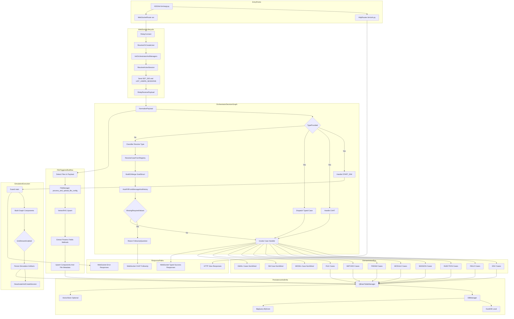

# BestBrain Workflow Mastermap

Exhaustive workflow representation of currently discoverable runtime actions and branches across the project, including wired, partially wired, and currently non-wired action surfaces.

## Inferred Engine Intent

From `README.md` and in-code TODO/FIXME markers, the intended engine is:
- A case-driven orchestration runtime where WebSocket traffic is normalized, classified, validated, and dispatched deterministically.
- A simulation core where `Guard` executes graph-oriented workflows with reliable method and parameter linkage.
- A persistent state platform where managers share QBRAIN table contracts and support local (`DuckDB`) or remote (`BigQuery`) backends.
- A production-ready control plane with stronger contract validation, observability, and edge-case coverage without heavy latency regressions.

## Master Workflow (Single Diagram)

## Action Surface Inventory

### Wired Relay Action Domains (`predefined_case.py`)
- ENV: 7 actions
- FIELD: 8 actions
- INJECTION: 8 actions
- SESSION: 4 actions
- MODULE: 10 actions
- PARAM: 6 actions
- METHOD: 8 actions
- FILE: 1 action
- Total wired relay actions: 52 (includes aliases and placeholder function bindings)

### Non-Wired or Partial Action Domains
- MODEL (`QUERY_MODEL`) defined in `core/model_manager/case.py` but not included in `RELAY_CASES_CONFIG`.
- SM (`ENABLE_SM`) defined in `core/sm_manager/case.py` but not included in `RELAY_CASES_CONFIG`.
- GMAIL action bus (`_gmail/case.py`) exists in alternate structure and is not wired into relay dispatch.
- Injection session handlers exist in `core/injection_manager/injection.py` but are missing from `RELAY_INJECTION` case list:
  - `LINK_SESSION_INJECTION`
  - `RM_LINK_SESSION_INJECTION`
  - `GET_SESSIONS_INJECTIONS`

### Special WebSocket Action Types (No Explicit Case Dict)
- `CHAT`
- `START_SIM`
- `SET_SID` (bootstrap message)
- `LIST_USERS_SESSIONS` (bootstrap message)
- `ERROR`
- `classification_error`

### HTTP Action Surface
- Mounted:
  - `/admin/`
  - `/health/`
  - `/world/demo/`
  - `/world/webhook/`
  - `/auth/access/`
  - `/graph/view/`
  - `/graph/brain/test/`
- Existing but not currently mounted in main URL config:
  - `/bq/upsert/`
  - `/bq/get/`

## All-Possibilities Action Appendix

`Trigger` legend: `WS_TYPED`, `WS_INFERRED`, `WS_SYSTEM`, `HTTP`.

### ENV Domain (`core/env_manager/case.py`)
- `SET_ENV` | Trigger: `WS_TYPED` | Required: `auth.user_id`, `auth.original_id`, `data.env` | Handler: `handle_set_env` | Side effects: upsert env, refresh env list.
- `GET_ENV` | Trigger: `WS_TYPED` | Required: `auth.env_id` | Handler: `handle_get_env` | Side effects: fetch single env payload.
- `GET_USERS_ENVS` | Trigger: `WS_TYPED` | Required: `auth.user_id` | Handler: `handle_get_envs_user` | Side effects: fetch user env table rows.
- `DEL_ENV` | Trigger: `WS_TYPED` | Required: `auth.env_id`, `auth.user_id` | Handler: `handle_del_env` | Side effects: delete env, return updated list.
- `DOWNLOAD_MODEL` | Trigger: `WS_TYPED` | Required: `auth.env_id`, `auth.user_id` | Handler: `handle_download_model` | Side effects: retrieve model artifacts.
- `RETRIEVE_LOGS_ENV` | Trigger: `WS_TYPED` | Required: `auth.env_id`, `auth.user_id` | Handler: `handle_retrieve_logs_env` | Side effects: fetch run logs.
- `GET_ENV_DATA` | Trigger: `WS_TYPED` | Required: `auth.env_id`, `auth.user_id` | Handler: `handle_get_env_data` | Side effects: fetch environment runtime data.

### FIELD Domain (`core/fields_manager/case.py`)
- `SET_FIELD` | Trigger: `WS_TYPED` or `WS_INFERRED` | Required: `auth.user_id`, `auth.original_id`, `data.field` | Handler: `handle_set_field` | Side effects: upsert field.
- `DEL_FIELD` | Trigger: `WS_TYPED` | Required: `auth.field_id`, `auth.user_id` | Handler: `handle_del_field` | Side effects: delete field.
- `LIST_USERS_FIELDS` | Trigger: `WS_TYPED` | Required: `auth.user_id` | Handler: `handle_list_users_fields` | Side effects: list fields.
- `LIST_MODULES_FIELDS` | Trigger: `WS_TYPED` | Required: `auth.module_id`, `auth.user_id` | Handler: `handle_list_modules_fields` | Side effects: list fields linked to module.
- `GET_MODULES_FIELDS` | Trigger: `WS_TYPED` | Required: `auth.user_id`, `auth.module_id` | Handler: `handle_get_modules_fields` | Side effects: fetch module field list.
- `LINK_MODULE_FIELD` | Trigger: `WS_TYPED` | Required: `auth.user_id`, `auth.module_id`, `auth.field_id`, `auth.session_id`, `auth.env_id` | Handler: `handle_link_module_field` | Side effects: create module-field link.
- `RM_LINK_MODULE_FIELD` | Trigger: `WS_TYPED` | Required: `auth.user_id`, `auth.module_id`, `auth.field_id` | Handler: `handle_rm_link_module_field` | Side effects: remove link.
- `SESSIONS_FIELDS` | Trigger: `WS_TYPED` | Required: `auth.user_id`, `auth.session_id` | Handler: `handle_get_sessions_fields` | Side effects: list session field relations.

### INJECTION Domain (`core/injection_manager/case.py`)
- `SET_INJ` | Trigger: `WS_TYPED` | Required: `auth.user_id`, `auth.original_id`, `data.id`, `data.data`, `data.ntype` | Handler: `handle_set_inj` | Side effects: upsert injection.
- `DEL_INJ` | Trigger: `WS_TYPED` | Required: `auth.injection_id`, `auth.user_id` | Handler: `handle_del_inj` | Side effects: delete injection.
- `GET_INJ_USER` | Trigger: `WS_TYPED` | Required: `auth.user_id` | Handler: `handle_get_inj_user` | Side effects: list user injections.
- `GET_INJ_LIST` | Trigger: `WS_TYPED` | Required: `auth.user_id`, `data.inj_ids` | Handler: `handle_get_inj_list` | Side effects: bulk fetch injections.
- `LINK_INJ_ENV` | Trigger: `WS_TYPED` | Required: `auth.injection_id`, `auth.env_id`, `auth.user_id` | Handler: `handle_link_inj_env` | Side effects: create env-injection link.
- `RM_LINK_INJ_ENV` | Trigger: `WS_TYPED` | Required: `auth.injection_id`, `auth.env_id`, `auth.user_id` | Handler: `handle_rm_link_inj_env` | Side effects: remove env-injection link.
- `LIST_LINK_INJ_ENV` | Trigger: `WS_TYPED` | Required: `auth.env_id`, `auth.user_id` | Handler: `handle_list_link_inj_env` | Side effects: list env injection links.
- `GET_INJECTION` | Trigger: `WS_TYPED` | Required: `data.id` or `data.injection_id` | Handler: `handle_get_injection` | Side effects: fetch one injection.
- Missing but implemented handlers (not in registry): `LINK_SESSION_INJECTION`, `RM_LINK_SESSION_INJECTION`, `GET_SESSIONS_INJECTIONS`.

### SESSION Domain (`core/session_manager/case.py`)
- `LINK_ENV_SESSION` | Trigger: `WS_TYPED` | Required: `auth.user_id`, `auth.session_id`, `auth.env_id` | Handler: `handle_link_env_session` | Side effects: session-env linking.
- `RM_LINK_ENV_SESSION` | Trigger: `WS_TYPED` | Required: `auth.user_id`, `auth.session_id`, `auth.env_id` | Handler: `handle_rm_link_env_session` | Side effects: unlink session-env.
- `GET_SESSIONS_ENVS` | Trigger: `WS_TYPED` | Required: `auth.user_id`, `auth.session_id` | Handler: `handle_get_sessions_envs` | Side effects: list session envs.
- `LIST_USERS_SESSIONS` | Trigger: `WS_TYPED` and `WS_SYSTEM` bootstrap | Required: `auth.user_id` | Handler: `handle_list_user_sessions` | Side effects: list user sessions.

### MODULE Domain (`core/module_manager/ws_modules_manager/case.py`)
- `SET_MODULE` | Trigger: `WS_TYPED` | Required: `auth.user_id`, `auth.original_id`, `data.id` | Handler: `handle_set_module` | Side effects: upsert module.
- `DEL_MODULE` | Trigger: `WS_TYPED` | Required: `auth.module_id`, `auth.user_id` | Handler: `handle_del_module` | Side effects: delete module.
- `GET_MODULE` | Trigger: `WS_TYPED` | Required: `auth.module_id` | Handler: `handle_get_module` | Side effects: fetch module.
- `LIST_USERS_MODULES` | Trigger: `WS_TYPED` | Required: `auth.user_id` | Handler: `handle_list_users_modules` | Side effects: list modules.
- `GET_SESSIONS_MODULES` | Trigger: `WS_TYPED` | Required: `auth.user_id`, `auth.session_id` | Handler: `handle_get_sessions_modules` | Side effects: list modules linked to session.
- `LINK_SESSION_MODULE` | Trigger: `WS_TYPED` | Required: `auth.user_id`, `auth.session_id`, `auth.module_id` | Handler: `handle_link_session_module` | Side effects: create link.
- `RM_LINK_SESSION_MODULE` | Trigger: `WS_TYPED` | Required: `auth.user_id`, `auth.session_id`, `auth.module_id` | Handler: `handle_rm_link_session_module` | Side effects: remove link.
- `LINK_ENV_MODULE` | Trigger: `WS_TYPED` | Required: `auth.user_id`, `auth.session_id`, `auth.env_id`, `auth.module_id` | Handler: `handle_link_env_module` | Side effects: create env-module link.
- `RM_LINK_ENV_MODULE` | Trigger: `WS_TYPED` | Required: `auth.user_id`, `auth.session_id`, `auth.env_id`, `auth.module_id` | Handler: `handle_rm_link_env_module` | Side effects: remove env-module link.
- `CONVERT_MODULE` | Trigger: `WS_TYPED` | Required: `auth.module_id`, `data.files` | Handler: `None` (`func_name` placeholder) | Side effects: currently unresolved dispatch path.

### PARAM Domain (`core/param_manager/case.py`)
- `SET_PARAM` | Trigger: `WS_TYPED` | Required: `auth.user_id`, `auth.original_id`, `data.param` | Handler: `handle_set_param` | Side effects: upsert parameter.
- `DEL_PARAM` | Trigger: `WS_TYPED` | Required: `auth.user_id`, `auth.param_id` | Handler: `handle_del_param` | Side effects: delete parameter.
- `LIST_USERS_PARAMS` | Trigger: `WS_TYPED` | Required: `auth.user_id` | Handler: `handle_get_users_params` | Side effects: list params.
- `LINK_FIELD_PARAM` | Trigger: `WS_TYPED` | Required: `auth.user_id`, `data.links` | Handler: `handle_link_field_param` | Side effects: field-param links.
- `RM_LINK_FIELD_PARAM` | Trigger: `WS_TYPED` | Required: `auth.user_id`, `auth.field_id`, `auth.param_id` | Handler: `handle_rm_link_field_param` | Side effects: unlink field-param.
- `GET_FIELDS_PARAMS` | Trigger: `WS_TYPED` | Required: `auth.user_id`, `auth.field_id` | Handler: `handle_get_fields_params` | Side effects: fetch params for field.

### METHOD Domain (`core/method_manager/case.py`)
- `SET_METHOD` | Trigger: `WS_TYPED` | Required: `auth.user_id`, `auth.original_id`, method data payload | Handler: `handle_set_method` | Side effects: upsert method code/equation.
- `DEL_METHOD` | Trigger: `WS_TYPED` | Required: `auth.user_id`, `auth.method_id` | Handler: `handle_del_method` | Side effects: delete method.
- `GET_METHOD` | Trigger: `WS_TYPED` | Required: `auth.method_id` | Handler: `handle_get_method` | Side effects: fetch one method.
- `LIST_USERS_METHODS` | Trigger: `WS_TYPED` | Required: `auth.user_id` | Handler: `handle_list_users_methods` | Side effects: list methods.
- `GET_USERS_METHODS` | Trigger: `WS_TYPED` | Required: `auth.user_id` | Handler: `handle_list_users_methods` | Side effects: alias to list methods.
- `GET_SESSIONS_METHODS` | Trigger: `WS_TYPED` | Required: `auth.user_id`, `auth.session_id` | Handler: `handle_get_sessions_methods` | Side effects: list linked methods.
- `LINK_SESSION_METHOD` | Trigger: `WS_TYPED` | Required: `auth.user_id`, `auth.method_id`, `auth.session_id` | Handler: `handle_link_session_method` | Side effects: create link.
- `RM_LINK_SESSION_METHOD` | Trigger: `WS_TYPED` | Required: `auth.user_id`, `auth.method_id`, `auth.session_id` | Handler: `handle_rm_link_session_method` | Side effects: remove link.

### FILE Domain (`core/file_manager/case.py`)
- `SET_FILE` | Trigger: `WS_TYPED` and implicit file branch in orchestrator | Required: `auth.user_id`, `auth.original_id`, file payload data | Handler: `handle_set_file` | Side effects: upload/process files, derive components, update modules.

### Additional Case Domains Present But Not Wired In Main Registry
- MODEL (`core/model_manager/case.py`)
  - `QUERY_MODEL` | Trigger: `WS_TYPED` | Handler: `handle_query_model` | Wiring: not added to `RELAY_CASES_CONFIG`.
- SM (`core/sm_manager/case.py`)
  - `ENABLE_SM` | Trigger: `WS_TYPED` | Handler: `handle_enable_sm` | Wiring: not added to `RELAY_CASES_CONFIG`.
- USER (`core/user_manager/case.py`)
  - `RELAY_USER` currently empty.
- GMAIL (`_gmail/case.py`)
  - `SEND_BOT_FAILED`, `DEV_EMAIL_ACTOR_FAILED`, `SEND_CRAWL_FAILED`, `SEND_MODEL_DEPLOYMENT_FAILED`, `SEND_SUCCESS_CONTENT`, `WELCOME_EMAIL`.
  - Wiring state: separate dataclass-based shape, not consumed by current relay dispatcher.

### HTTP Endpoints
- `/health/` | Trigger: `HTTP` | Role: service liveness.
- `/world/demo/` | Trigger: `HTTP` | Role: world demo flow.
- `/world/webhook/` | Trigger: `HTTP` | Role: Stripe webhook ingestion.
- `/auth/access/` | Trigger: `HTTP` | Role: auth credential access gateway.
- `/graph/view/` | Trigger: `HTTP` | Role: graph view API.
- `/graph/brain/test/` | Trigger: `HTTP` | Role: brain test API.
- `/admin/` | Trigger: `HTTP` | Role: admin interface.
- `/bq/upsert/` and `/bq/get/` | Trigger: `HTTP` | Role: BQ CRUD service; defined but currently not mounted in `bm/urls.py`.

## Inconsistencies, Edge Cases, and Risk Flags

- Naming mismatch classes: mixed `LIST_*`, `GET_*`, and `SESSIONS_*` conventions for similar list semantics.
- Placeholder case binding: `CONVERT_MODULE` has `func=None`.
- Missing injection session cases in case registry despite implemented handlers.
- Non-wired domain cases (`MODEL`, `SM`, `GMAIL`) reduce discoverability and create hidden capability.
- No central machine-readable contract artifact for all case request schemas.
- `CHAT` and `START_SIM` are implemented as branch logic, not first-class case entries.

## Optimized Engine Roadmap

Prioritization target: balanced edge-case coverage and performance.

### MustDo (P0: hardening and correctness)
- [ ] Unify case registry so wired action surfaces and implemented handlers match one-to-one.
- [ ] Add payload contract validation at relay ingress (required keys, type checks, unknown field policy).
- [ ] Implement deterministic case fallback for `CHAT` and `START_SIM` as first-class registry entries or equivalent contract wrappers.
- [ ] Close `CONVERT_MODULE` placeholder path with concrete callable binding and tests.
- [ ] Add Guard consistency guarantees:
  - answer caching,
  - method-param-field reconciliation,
  - deterministic ordering for repeated runs.
- [ ] Implement `get_data` live bridge objective (BigQuery to tabular display pipeline) from root TODO intent.
- [ ] Remove hardcoded test identity flows (`TEST_USER_ID` style TODO hotspots) from runtime paths.

### ShouldDo (P1: performance and operational maturity)
- [ ] Add per-case latency and error instrumentation for Relay -> Orchestrator -> Manager -> DB path.
- [ ] Introduce async-safe batching for heavy link and retrieval actions.
- [ ] Reduce repeated query patterns in managers with batched `get` and `link` operations.
- [ ] Add session lifecycle controls: idle timeout, reconnect semantics, explicit closure audit.
- [ ] Stabilize graph serialization and runtime graph/persistence boundary in `graph/local_graph_utils.py`.

### NiceToHave (P2: acceleration and advanced ergonomics)
- [ ] Auto-suggest missing links before `START_SIM` (module-field, field-param, session-method, env-injection).
- [ ] Build workflow replay timeline for each session.
- [ ] Add policy-based optimizer that proposes minimal remediation for failed simulations.
- [ ] Add schema drift detector and migration assistant for QBRAIN tables.
- [ ] Expand model and gmail action buses into normalized case contracts.

## Suggested Implementation Sequence

1. Case registry parity and payload contract validation.
2. Guard correctness and method extraction reliability.
3. Observability and benchmark baseline.
4. Async and batching optimization pass.
5. UX and recommendation enhancements.

## Completion Criteria for the Optimized Engine

- Every discoverable action has explicit wiring state and contract.
- Every wired action has testable ingress validation and deterministic output envelope.
- `START_SIM` and file-driven extraction paths are traceable and observable.
- Core entity lifecycle (`session -> env -> module -> field -> param -> method -> execution`) is reproducible.
- Security and identity defaults avoid development placeholders in production flow.

