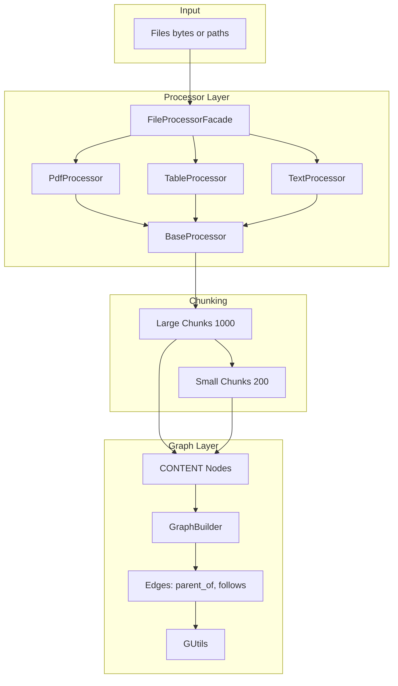

# Prompt: Production-Ready Knowledge Graph from Chunked File Content

## Objective

Adapt the `graph.processor` to build a knowledge graph from chunked file content. Create `type=CONTENT` nodes for each chunk, link them modularly (parent-child, sequential, optionally file-level), and persist the graph via GUtils. The processor remains format-agnostic (PDF, CSV, text, images); the graph layer consumes chunk rows and produces a traversable knowledge graph.

## Current Flow

1. **FileProcessorFacade** ([graph/processor/main.py](graph/processor/main.py)): Routes by extension to PdfProcessor, TableProcessor, TextProcessor, or ImageProcessor.
2. **BaseProcessor** ([graph/processor/base.py](graph/processor/base.py)): Loads documents, splits into large (1000) and small (200) chunks via `RecursiveCharacterTextSplitter`, wraps in `KnowledgeNode` (from `..models`), returns `List[Dict]` via `to_dict()`.
3. **Output**: Flat list of chunk rows. No graph construction, no GUtils integration.
4. **KnowledgeNode**: Imported from `graph.models`; model must provide `id`, `content`, `source_file`, `chunk_type`, `parent_id`, `page`, `category`, `tags`, and `to_dict()`.

## Target Flow

1. **Processor**: Unchanged chunking logic. Returns `List[Dict]` (KnowledgeNode rows).
2. **GraphBuilder**: New component that accepts rows + GUtils, adds CONTENT nodes, adds edges (parent_of, follows, optionally part_of_file).
3. **FileProcessorFacade**: New method `process_to_graph(file_path, g: GUtils)` or `process_file` returns rows; caller optionally passes rows + g to GraphBuilder.
4. **GUtils**: Receives CONTENT nodes and edges. `local_batch_loader` persists to schemas for downstream DB push.

## Architecture



## Node Schema: CONTENT

| Field | Type | Description |
|-------|------|-------------|
| id | str | Unique id, e.g. `{filename}_p{i}` or `{filename}_p{i}_c{j}` |
| type | str | Always `"CONTENT"` |
| content | str | Chunk text |
| source_file | str | Basename of source file |
| chunk_type | str | `"large"` or `"small"` |
| parent_id | str \| None | Parent large chunk id; None for large chunks |
| page | int | Page number (0 if N/A) |
| category | str | `"Document"` \| `"Data"` \| `"Code"` |
| tags | List[str] | e.g. `["pdf"]`, `["child"]` |

## Edge Schema: Modular Links

| rel | src_layer | trgt_layer | Description |
|-----|-----------|------------|-------------|
| parent_of | CONTENT | CONTENT | Large chunk → small chunk |
| follows | CONTENT | CONTENT | Sequential chunk i → chunk i+1 (same parent) |
| part_of_file | CONTENT | FILE | Chunk → source file node (optional) |

## Implementation Details

### 1. KnowledgeNode Model

- **Where**: Create `graph/models.py`.
- **Structure**: Dataclass or TypedDict with fields: `id`, `content`, `source_file`, `chunk_type`, `parent_id`, `page`, `category`, `tags`.
- **Method**: `to_dict() -> dict` returns dict with `type="CONTENT"` added for GUtils compatibility.
- **Import**: Update `graph/processor/base.py` to `from graph.models import KnowledgeNode` (or `from ..models` if `graph/models.py` exists).

Example:

```python
from dataclasses import dataclass
from typing import List, Optional

@dataclass
class KnowledgeNode:
    id: str
    content: str
    source_file: str
    chunk_type: str  # "large" | "small"
    parent_id: Optional[str]
    page: int
    category: str
    tags: List[str]

    def to_dict(self) -> dict:
        return {
            "id": self.id,
            "type": "CONTENT",
            "content": self.content,
            "source_file": self.source_file,
            "chunk_type": self.chunk_type,
            "parent_id": self.parent_id,
            "page": self.page,
            "category": self.category,
            "tags": self.tags,
        }
```

### 2. GraphBuilder

- **Where**: Create `graph/processor/graph_builder.py`.
- **Interface**:

```python
def build_graph(rows: List[Dict[str, Any]], g: GUtils, add_file_nodes: bool = False) -> int:
    """
    Add CONTENT nodes and edges to GUtils. Returns count of nodes added.
    rows: List of KnowledgeNode.to_dict() outputs.
    g: GUtils instance.
    add_file_nodes: If True, create FILE nodes and part_of_file edges.
    """
```

- **Logic**:
  1. For each row: `g.add_node(attrs={**row, "type": "CONTENT"})`.
  2. For each row with `parent_id`: add edge `(parent_id, row["id"], rel="parent_of", src_layer="CONTENT", trgt_layer="CONTENT")`.
  3. For sequential small chunks under same parent: add `follows` edge from chunk j to chunk j+1.
  4. If `add_file_nodes`: ensure FILE node per source_file, add `part_of_file` from each CONTENT to its FILE.

### 3. Edge Creation Rules

- **parent_of**: For every row with `parent_id is not None`, add edge `parent_id -> row["id"]`.
- **follows**: Group rows by `parent_id`. Within each group, sort by id (or by index in original list). Add edge `row[i] -> row[i+1]` with `rel="follows"`.
- **part_of_file**: Optional. Create FILE node with `id=source_file` (or sanitized), `type="FILE"`. Add edge `row["id"] -> source_file` with `rel="part_of_file"`, `src_layer="CONTENT"`, `trgt_layer="FILE"`.

### 4. FileProcessorFacade Integration

- **Option A**: Add `process_to_graph(self, file_path: str, g: GUtils) -> int` that calls `process_file(file_path)`, then `GraphBuilder.build_graph(rows, g)`, returns node count.
- **Option B**: Keep `process_file` returning rows; caller does `GraphBuilder.build_graph(processor.process_file(path), g)`.
- Prefer Option A for convenience; Option B for maximum flexibility.

### 5. GUtils Compatibility

- **add_node**: GUtils expects `attrs` with `id` and `type`. CONTENT rows must include `type="CONTENT"`.
- **add_edge**: Requires `src`, `trt`, and `attrs` with `src_layer`, `trgt_layer`, `rel`. See [graph/local_graph_utils.py](graph/local_graph_utils.py) lines 173-266.
- **local_batch_loader**: Table name derived from `type`; CONTENT nodes go to schema `CONTENT`; edges go to `CONTENT_parent_of_CONTENT`, `CONTENT_follows_CONTENT`, etc.

### 6. Modular Linking Strategy

- **Phase 1 (required)**: `parent_of` edges (large → small).
- **Phase 2 (required)**: `follows` edges (sequential within parent).
- **Phase 3 (optional)**: FILE nodes and `part_of_file` edges.
- **Phase 4 (future)**: Cross-file semantic links via embeddings (out of scope).

## File Changes Summary

| File | Change |
|------|--------|
| `graph/models.py` | Create. Define `KnowledgeNode` dataclass with `to_dict()`. |
| `graph/processor/graph_builder.py` | Create. `build_graph(rows, g, add_file_nodes)` adds CONTENT nodes and edges. |
| `graph/processor/base.py` | Update import: `from graph.models import KnowledgeNode` (or `from ..models` if graph has `__init__.py` exporting it). |
| `graph/processor/main.py` | Add `process_to_graph(file_path, g)` that calls `process_file` + `GraphBuilder.build_graph`. |
| `graph/processor/__init__.py` | Export `GraphBuilder` and `KnowledgeGraphBuilder` if aliased. |

## Edge Cases

- **Empty content**: Skip chunks with empty or whitespace-only `content`. Do not add nodes.
- **Duplicate ids**: Use deterministic ids (`{filename}_p{i}_c{j}`). Re-processing same file overwrites nodes if GUtils updates in place; otherwise consider id prefix by session or timestamp.
- **Single chunk**: No `follows` edge. Only `parent_of` if it has parent (small chunks always do).
- **Large files**: Chunking already handles size. GraphBuilder is O(n) in rows; no special handling.
- **Missing parent_id**: If a row has `parent_id` but parent not in rows, still add the node; edge creation can skip or add (GUtils may auto-create placeholder nodes). Prefer skipping edge if parent not in current batch to avoid orphan references.

## Environment Variables

| Variable | Purpose |
|----------|---------|
| `GRAPH_CONTENT_CHUNK_LARGE` | Large chunk size. Default: 1000. |
| `GRAPH_CONTENT_CHUNK_SMALL` | Small chunk size. Default: 200. |
| `GRAPH_ADD_FILE_NODES` | If `true`, add FILE nodes and part_of_file edges. Default: false. |

## Testing

1. Unit test: Create mock rows (1 parent + 2 children), call `build_graph`, assert 3 CONTENT nodes, 2 parent_of edges, 1 follows edge.
2. Integration test: `process_to_graph("sample.pdf", g)`, assert `g.G` has CONTENT nodes and edges.
3. Empty file: Process empty or whitespace-only file, assert no nodes added.

---

## Implementation Prompt (Copy-Paste)

Implement the following in the BestBrain codebase:

1. **graph/models.py**: Create a `KnowledgeNode` dataclass with fields `id`, `content`, `source_file`, `chunk_type`, `parent_id`, `page`, `category`, `tags`. Implement `to_dict()` returning a dict with `type="CONTENT"` included.

2. **graph/processor/graph_builder.py**: Create `build_graph(rows: List[Dict], g: GUtils, add_file_nodes: bool = False) -> int`. For each row, add a CONTENT node via `g.add_node(attrs={**row, "type": "CONTENT"})`. For rows with `parent_id`, add edge `(parent_id, row["id"], rel="parent_of", src_layer="CONTENT", trgt_layer="CONTENT")`. For sequential small chunks under the same parent, add `follows` edges. If `add_file_nodes`, create FILE nodes per `source_file` and add `part_of_file` edges. Return the number of nodes added.

3. **graph/processor/base.py**: Ensure `from graph.models import KnowledgeNode` (or `from ..models import KnowledgeNode` if `graph/models.py` exists and is in package).

4. **graph/processor/main.py**: Add `process_to_graph(self, file_path: str, g: GUtils) -> int` that calls `process_file(file_path)` to get rows, then `GraphBuilder.build_graph(rows, g)`, and returns the node count.

5. **Modular linking**: Follow the edge schema (parent_of, follows, part_of_file). Keep processor and GraphBuilder separate: processor produces rows, GraphBuilder consumes rows and populates the graph.
