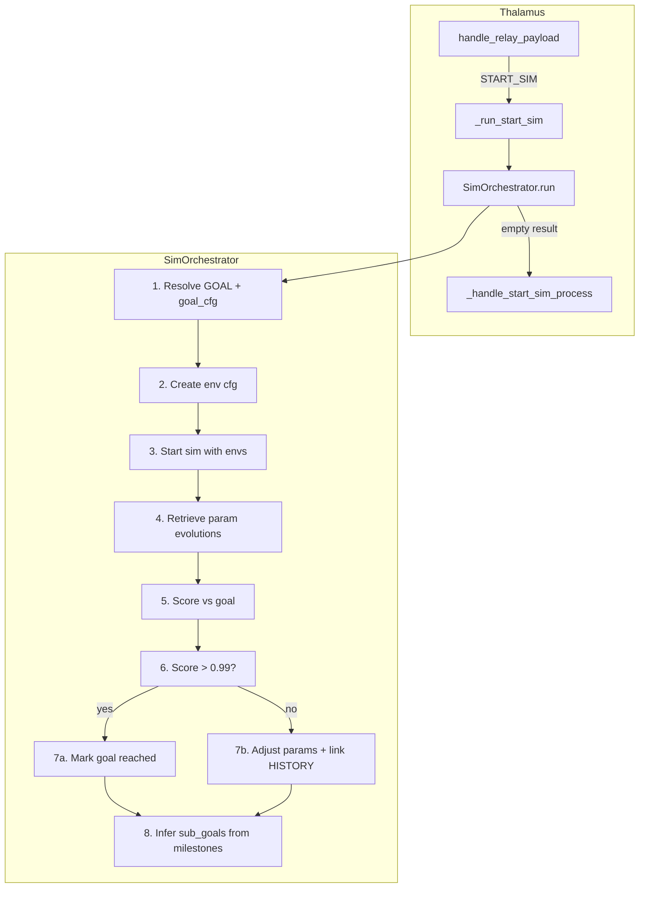

# SimOrchestrator Workflow

Visual pathway and step-by-step description of the start-sim process allocated to the Brain sub-module.

## Overview

The **SimOrchestrator** is a Brain sub-module that orchestrates the full start-sim workflow: goal-driven env cfg creation, sim execution, param evolution scoring, history-based adjustment, and sub_goal inference from milestones. The START_SIM option remains in Thalamus, which delegates to SimOrchestrator.

## Architecture



## Data Flow

```
GOAL node (Brain) / payload.goal_id
    |
    v
goal_cfg, sub_goals (from goals table or payload)
    |
    v
Env cfg (payload.config or built from goal + envs param evolution)
    |
    v
Guard.main() per env
    |
    v
Param evolutions (envs table p_* columns)
    |
    v
compute_goal_score() -> sum score
    |
    +-- score > 0.99 --> Mark goal reached, return True
    |
    +-- else --> suggest_param_adjustments, link ENV --[HISTORY]--> GOAL
    |
    v
Infer SUB_GOAL from short-term milestones
```

## Step-by-Step Description

### 1. Resolve GOAL and goal_cfg

- **Source**: `brain.last_goal_node_id` or `payload.data.goal_id`
- **goal_cfg**: From `payload.data.goal_cfg` or goals table `target_cfg` (user_id, goal_id)
- **sub_goals**: SUB_GOAL nodes linked to GOAL via `REQUIRES`
- **File**: [sim_orchestrator.py](../graph/brn/sim_orchestrator.py) `_resolve_goal_and_cfg()`

### 2. Create env cfg (adjust injection properties)

- If `payload.data.config` exists, use it.
- Else: Query envs for `user_id` (and `goal_id`) via `env_manager.retrieve_envs_by_user_goal()`
- Compare wanted evolution (goal_cfg) with retrieved param evolutions
- Adjust injection properties per param; merge `goal_targets` into env_data
- **File**: [sim_orchestrator.py](../graph/brn/sim_orchestrator.py) `_create_env_cfg_from_goal()`, `_adjust_injections_from_goal()`

### 3. Start sim with all envs

- For each env in config: `guard.main(env_id, env_data, grid_streamer, grid_animation_recorder)`
- Set `ENV_ID`, `USER_ID`, `GOAL_ID` for jax_test guard persistence
- **File**: [guard.py](../core/guard.py) `main()`, [sim_orchestrator.py](../graph/brn/sim_orchestrator.py) `run()`

### 4. Retrieve param evolutions

- `sim_analyzer.analyze_envs_for_user_goal(user_id, goal_id)`
- Parses `p_*` columns from env rows
- **File**: [sim_result_analyzer.py](../core/sim_analyzer/sim_result_analyzer.py) `analyze_envs_for_user_goal()`

### 5. Score vs goal

- `sim_analyzer.compute_goal_score(analysis, goal_cfg, tolerance=0.1)`
- Compares final param values (last step of `values`) to goal_cfg targets
- Per-param: `score_i = 1 - min(1, |actual - target| / tolerance)`
- Returns mean score
- **File**: [sim_result_analyzer.py](../core/sim_analyzer/sim_result_analyzer.py) `compute_goal_score()`

### 6. Goal reached or adjust

- **If score >= 0.99**: Mark goal reached (goals table `status = 'reached'`), return `goal_reached: True`
- **Else**: Call `suggest_param_adjustments()`, retrieve history envs, link env node to goal with `rel=HISTORY`
- **File**: [sim_orchestrator.py](../graph/brn/sim_orchestrator.py) `_mark_goal_reached()`, `_link_env_to_goal_history()`

### 7. Link env to goal with HISTORY

- Create ENV node `ENV::{user_id}::{env_id}` if needed
- Add edge `env_node --[HISTORY]--> goal_node`
- **Schema**: [brain_schema.py](../graph/brn/brain_schema.py) `BrainEdgeRel.HISTORY`

### 8. Infer sub_goals from milestones

- Scan `brain.short_term_ids` for markers: `milestone:`, `checkpoint:`, `process finished:`, `step completed:`
- Create SUB_GOAL node with `milestone_description`, link to GOAL via `REQUIRES`
- **File**: [sim_orchestrator.py](../graph/brn/sim_orchestrator.py) `_infer_sub_goals_from_milestones()`

## File References

| Component | File |
|-----------|------|
| SimOrchestrator | [qbrain/graph/brn/sim_orchestrator.py](../graph/brn/sim_orchestrator.py) |
| Thalamus wiring | [qbrain/core/orchestrator_manager/orchestrator.py](../core/orchestrator_manager/orchestrator.py) |
| SimResultAnalyzer | [qbrain/core/sim_analyzer/sim_result_analyzer.py](../core/sim_analyzer/sim_result_analyzer.py) |
| compute_goal_score | [sim_result_analyzer.py](../core/sim_analyzer/sim_result_analyzer.py) |
| BrainEdgeRel.HISTORY | [qbrain/graph/brn/brain_schema.py](../graph/brn/brain_schema.py) |
| Guard | [qbrain/core/guard.py](../core/guard.py) |
| EnvManager | [qbrain/core/env_manager/env_lib.py](../core/env_manager/env_lib.py) |

## Thalamus Integration

- **Entry**: `handle_relay_payload()` checks `data_type == "START_SIM"`
- **Delegate**: Calls `_run_start_sim()` which invokes `sim_orchestrator.run()`
- **Fallback**: If SimOrchestrator returns empty, falls back to `_handle_start_sim_process()` (legacy flow)
